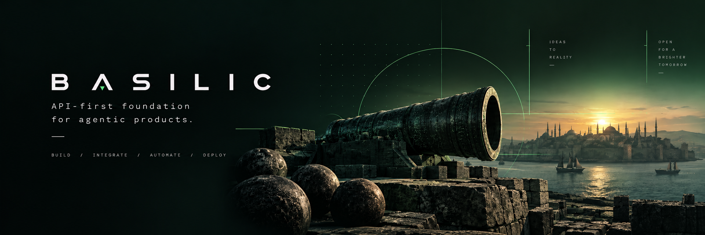

# Basilic

Start a product without wiring auth, clients, and agent hosts from scratch. You get a multi-client, agentic architecture already in place — Next.js with Generative UI, an HTTP API, generated clients, and a CLI — so the work goes into features.

[Docs](https://basilic-docs.vercel.app/docs) · [Getting Started](https://basilic-docs.vercel.app/docs/development) · [Architecture](https://basilic-docs.vercel.app/docs/architecture)

## Capabilities

**Product contract**

- **Product API** — Fastify REST, generated OpenAPI, `/llms.txt`, RFC 9727 catalog
- **Multi-client auth** — session JWT, API keys, OAuth/passkey/magic, SIWE/SIWS
- **Generated clients** — `@repo/core` from the spec; `@repo/react` hooks

**Agentic surfaces**

- **Durable agents** — eve `command` and `chat` in `apps/agents` (this upstream tree; omitted from `create-basilic`)
- **Generative UI** — Jev + json-render + shadcn/Base UI
- **API CLI** — `basilic` for humans, scripts, and shell agents; API key; JSON stdout
- **Coding-agent contract** — `AGENTS.md`, Basilic `/w-*`, lock-installed skills

**Human clients**

- **Web** — Next.js on the API; host for Generative UI
- **Mobile** — Expo UI scaffold
- **End-to-end TypeScript** — schema → OpenAPI → clients

**How you ship**

- **Deploy** — Vercel + Supabase default
- **Quality and security** — Biome, Gitleaks, OSV, DeepSec
- **Multichain** — SIWE/SIWS, wallet modal, Alchemy reads (not send/swap)

## How it fits

Fastify is the scored product API. eve is a sibling host for durable turns. Next.js is a typed client; it does not own the API. Agents discover HTTP (`/openapi.json`, `/llms.txt`, RFC 9727). Diagram and capability table: [Architecture](https://basilic-docs.vercel.app/docs/architecture).

## Quick start

Start a product with `create-basilic`. It copies API, web, mobile, and shared packages into a new repo and leaves out the docs app, the generator, and `apps/agents`. Fork or clone this repository only to contribute.

```bash
npx create-basilic@latest my-app
cd my-app
pnpm setup
pnpm db:start
pnpm dev
```

Requires Node.js 24.x and pnpm 12.5.1. `pnpm setup` does not start Postgres. Named HTTPS hosts: [Dev environments](https://basilic-docs.vercel.app/docs/development/dev-environments). Root scripts: [Development tooling](https://basilic-docs.vercel.app/docs/development/dev-tooling).

The generator is `0.0.0` in this tree and is not on npm `latest` yet. Until it is, assemble and run it from a clone, then work in the generated directory — [Getting Started](https://basilic-docs.vercel.app/docs/development).

## Tree

**Apps**

- **[API](apps/api/README.md)** — Fastify OpenAPI product API
- **[Web](apps/web/README.md)** — Next.js client on `@repo/core`
- **[Mobile](apps/mobile/README.md)** — Expo UI scaffold (not an API client yet)
- **[Agents](apps/agents/README.md)** — eve `command` and `chat`
- **[Documentation](apps/docu/README.md)** — Fumadocs site

**Packages**

- **[@repo/core](packages/core/README.md)** — generated API client
- **[@repo/cli](packages/cli/README.md)** — API CLI (`basilic`)
- **[@repo/react](packages/react/README.md)** — React Query hooks
- **[@repo/ui](packages/ui/README.md)** — shadcn/Base UI catalog
- **[@repo/utils](packages/utils/README.md)** — shared utilities
- **[@repo/error](packages/error/README.md)** — error reporting
- **[@repo/email](packages/email/README.md)** — React Email templates
- **[@repo/db](packages/db/README.md)** — Drizzle schema and data access

## Documentation

- [Getting Started](https://basilic-docs.vercel.app/docs/development)
- [Contributing](CONTRIBUTING.md)
- [Product Ready](https://basilic-docs.vercel.app/docs/testing/product-ready)
- [After fork](https://basilic-docs.vercel.app/docs/development/after-fork)
- [AI workflow](https://basilic-docs.vercel.app/docs/development/ai-workflow)
- Visual: [`DESIGN.md`](DESIGN.md)

MIT licensed.
