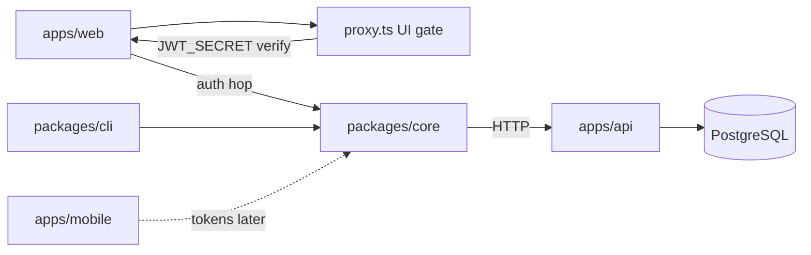

# Architecture First

## Principle

Decide system boundaries, dependency direction, and deployment shape before local implementation choices harden into structural constraints.

## Statement

I treat architecture as the small set of decisions that are expensive to reverse: where responsibilities live, which dependencies point where, what crosses a process or trust boundary, and how the system is deployed. I do not design every class in advance. I make the consequential structure visible before the codebase makes it accidentally.

## Outcome

The system has an inspectable structural model at the level its scale requires. Components have named responsibilities and owners. Dependency direction, external systems, data stores, and deployment units are visible. Consequential choices have rationale and known tradeoffs. Implementation conforms, or the model is updated deliberately.

## Artifacts

- **Fact:** [`../../apps/docu/content/docs/architecture/index.mdx`](../../apps/docu/content/docs/architecture/index.mdx) — stack overview
- **Fact:** [`../../apps/docu/content/docs/architecture/monorepo.mdx`](../../apps/docu/content/docs/architecture/monorepo.mdx) — apps vs packages
- **Fact:** [`../../apps/docu/content/docs/adrs/`](../../apps/docu/content/docs/adrs/) — ADRs 001–011
- **Fact:** Deployables: `apps/api` (system of record), `apps/web`, `apps/mobile` (UI scaffold), `apps/docu`
- **Fact:** Packages: `core` (generated client), handwritten `react`, `ui`, `utils`, `error`, `cli`, `email`. Security mail is `@repo/email` + Fastify `emailProvider`.
- **Fact:** Apps depend on packages, never the reverse. `react` depends on `core`. Clients call Fastify over HTTP.
- **Fact:** Store: PostgreSQL via `DATABASE_URL`. PGLite when `PGLITE=true` **or** `NODE_ENV=test`. Compiled PGLite requires SQL copied into `dist`. Supabase is the managed host, not the auth SDK.
- **Fact:** Externals: Vercel, Resend, OAuth IdPs, AI providers, Sentry/GlitchTip (**installed, inactive**), EAS, scanners
- **Fact:** Contract source is TypeBox on Fastify routes; OpenAPI is generated; core internals **and** public wrappers plus CLI metadata; React hooks handwritten
- **Fact:** Shipped deploy path is Vercel + `DATABASE_URL` Postgres ([portability.mdx](../../apps/docu/content/docs/architecture/portability.mdx))
- **Fact:** Web auth hop: browser → Next cookie route → SDK → Fastify. Cookie is SSR/security copy. Fastify is session SoT and revocation. Refresh reuse-grace on previous `jti`.
- **Fact:** Next `proxy.ts` is a JWT UI gate (shared `JWT_SECRET`), not revocation.
- **Fact:** `/health` is readiness: 503 when DB probe fails; no deep third-party probes
- **Unresolved:** GCP/AWS as first-class deploy targets; mobile as an API consumer
- **Unresolved:** dedicated ADRs for custom JWT + cookie BFF (rationale lives in authentication MDX)

## Minimum Useful Artifact

- purpose: TypeScript fullstack starter (API, web, mobile, docs)
- users: adopting developers; demo web users; CLI/agents with API keys
- deployable units: Fastify API, Next.js web, Expo mobile, Fumadocs
- data store: PostgreSQL (Drizzle in `apps/api`)
- dependencies: clients → `@repo/core` → HTTP → Fastify/TypeBox → Drizzle
- consequential decisions: ADRs 001 (monorepo), 002 (Fastify), 003 (Next), 004 (shadcn), 007/008 (Drizzle/Postgres), 009 (routes generate OpenAPI)

## Recipe

1. Inspect `apps/*`, `packages/*`, architecture MDX, ADRs, [`../../apps/docu/content/docs/deployment/`](../../apps/docu/content/docs/deployment/), Drizzle, and env.
2. Understand product capabilities and quality attributes that constrain the structure.
3. Identify accidental coupling (app-to-app imports, hand-edited OpenAPI, mobile pretending to be a client).
4. Propose the smallest structural clarification or ADR. Prefer one boundary over a redesign.
5. Record rationale, alternatives, consequences, and reconsideration trigger when consequential.
6. Implement with apps → packages direction visible.
7. Validate against code and deployment, not only the directory tree.
8. Update architecture MDX and ADRs when structure changes; update this instance with paths.

## Validation

- A new contributor can name apps, packages, responsibilities, and dependency direction from architecture MDX.
- Diagrams match code and deployment, or discrepancies are named (mobile, PostHog).
- New dependencies follow apps → packages; generated client from OpenAPI; no app-to-app imports.
- Consequential choices have ADRs, not only a technology name.
- Architecture stays proportional to a starter toolkit.

## Definition of Done

The structural decision is explicit, implemented, and validated. Boundaries and dependency direction are inspectable. Durable architecture artifacts match the system or record deliberate drift.

## Agent Prompt

Apply Architecture First to Basilic.

Read `apps/docu/content/docs/architecture/`, ADRs 001–011, Turborepo layout, deployment MDX, Drizzle, and external integrations. Inspect implementation; do not assume diagrams are current.

Treat Fastify route TypeBox as the HTTP contract source. OpenAPI is generated. Preserve intentional existing structure. Do not introduce services, layers, queues, or platforms because they are common elsewhere. Do not wire `apps/mobile` to `@repo/core` without a product decision.

Propose the smallest useful structural change or ADR. Record rationale and tradeoffs. Validate against code and deployment. Update architecture MDX when structure changes. Update this instance when paths change.

## Notes

**Architecture vs Product:** Product names the capability and constraints. Architecture assigns responsibilities and structural boundaries.

**Architecture vs Data:** Architecture places stores and data flows. Data owns canonical meaning, ownership, lifecycle, and evolution.

**Architecture vs API:** Architecture decides which components communicate. API defines the contract across a boundary (TypeBox, then generated OpenAPI).

**Architecture vs Pipelines:** Architecture describes deployment units and topology. Pipelines build, validate, and deliver them.

**Architecture vs Operations:** Architecture names the running parts. Operations observes and recovers them.

**Navigation:** [Generic spec](https://github.com/blockmatic/first/blob/main/_first/principles/ARCHITECTURE.md) · [Human essay](https://github.com/blockmatic/first/blob/main/_first/articles/ARCHITECTURE.md) · [Factory map](../ABOUT.md) · [Monorepo](../../apps/docu/content/docs/architecture/monorepo.mdx) · [API](../../apps/docu/content/docs/architecture/api.mdx)
