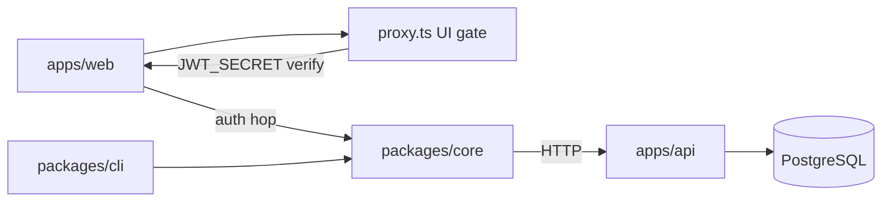

# Architecture First

## Principle

See /f-architecture.

## Artifacts

- **Fact:** [`../../apps/docu/content/docs/architecture/index.mdx`](../../apps/docu/content/docs/architecture/index.mdx) — stack overview
- **Fact:** [`../../apps/docu/content/docs/architecture/monorepo.mdx`](../../apps/docu/content/docs/architecture/monorepo.mdx) — apps vs packages
- **Fact:** [`../../apps/docu/content/docs/adrs/`](../../apps/docu/content/docs/adrs/) — ADRs 001–011
- **Fact:** Deployables: `apps/api` (system of record), `apps/web`, `apps/mobile` (UI scaffold), `apps/docu`
- **Fact:** Packages: `core` (generated client), handwritten `react`, `ui`, `utils`, `error`, `cli`, `email`. Security mail is `@repo/email` + Fastify `emailProvider`.
- **Fact:** Apps depend on packages, never the reverse. `react` depends on `core`. Clients call Fastify over HTTP.
- **Fact:** Store: PostgreSQL via `DATABASE_URL`. PGLite when `PGLITE=true` **or** `NODE_ENV=test`. Compiled PGLite requires SQL copied into `dist`. Supabase is the managed host, not the auth SDK.
- **Fact:** Externals: Vercel, Resend, OAuth IdPs, AI providers, Sentry/GlitchTip (**installed, inactive**), EAS, scanners
- **Fact:** Contract source is TypeBox on Fastify routes; OpenAPI is generated; core internals **and** public wrappers plus CLI metadata; React hooks handwritten
- **Fact:** Shipped deploy path is Vercel + `DATABASE_URL` Postgres ([portability.mdx](../../apps/docu/content/docs/architecture/portability.mdx))
- **Fact:** Web auth hop: browser → Next cookie route → SDK → Fastify. Cookie is SSR/security copy. Fastify is session SoT and revocation. Refresh reuse-grace on previous `jti`.
- **Fact:** Next `proxy.ts` is a JWT UI gate (shared `JWT_SECRET`), not revocation.
- **Fact:** `/health` is readiness: 503 when DB probe fails; no deep third-party probes
- **Drift:** concurrent legitimate refresh can revoke the live session (web proxy + SDK + Fastify rotate)
- **Drift:** compiled PGLite startup can miss migration SQL under `dist`
- **Unresolved:** GCP/AWS as first-class deploy targets; mobile as an API consumer
- **Unresolved:** dedicated ADRs for custom JWT + cookie BFF (rationale lives in authentication MDX)
- **Unresolved:** refresh ownership / concurrency protocol (Security shares this)

## Minimum Useful Artifact

- purpose: TypeScript fullstack starter (API, web, mobile, docs)
- users: adopting developers; demo web users; CLI/agents with API keys
- deployable units: Fastify API, Next.js web, Expo mobile, Fumadocs
- data store: PostgreSQL (Drizzle in `apps/api`)
- dependencies: clients → `@repo/core` → HTTP → Fastify/TypeBox → Drizzle
- consequential decisions: ADRs 001 (monorepo), 002 (Fastify), 003 (Next), 004 (shadcn), 007/008 (Drizzle/Postgres), 009 (routes generate OpenAPI)

## Notes

Product names the capability. Architecture assigns responsibilities. Data owns canonical meaning. API defines the contract. Workflow builds and delivers deployables. Operations observes them. Do not introduce services, layers, or queues because they are common elsewhere. Do not wire `apps/mobile` to `@repo/core` without a product decision.

**Navigation:** [Generic spec](https://github.com/blockmatic/first/blob/main/_first/principles/ARCHITECTURE.md) · [Human essay](https://github.com/blockmatic/first/blob/main/_first/articles/ARCHITECTURE.md) · [Factory map](../ABOUT.md) · [Monorepo](../../apps/docu/content/docs/architecture/monorepo.mdx) · [API](../../apps/docu/content/docs/architecture/api.mdx)
