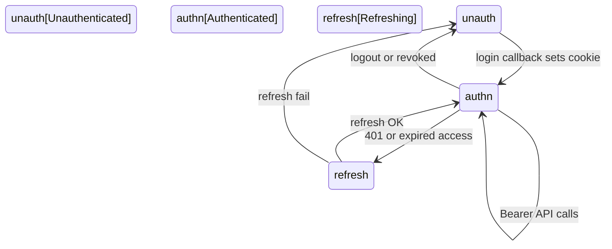

# Journeys First

## Principle

Map how someone finishes a job — including errors, permissions, and state — before implementation invents the path from whichever screen shipped first.

## Statement

The product is not a collection of screens. It is someone trying to finish a job. I map that job from entry to completion before I trust implementation to fill in the gaps. Happy paths are cheap. The product breaks in the alternates: the error nobody designed, the permission that exists on one route but not another, the state with no exit.

## Outcome

Actors, entry points, happy paths, alternates, error paths, permission gates, and completion criteria are documented or explicitly marked unknown. Missing states are visible before code hardens around an incomplete model.

## Artifacts

- **Fact:** [authentication.mdx](../../apps/docu/content/docs/architecture/authentication.mdx), [account-linking.mdx](../../apps/docu/content/docs/architecture/account-linking.mdx)
- **Fact:** Web gate: [`../../apps/web/proxy.ts`](../../apps/web/proxy.ts). Public: `/auth/login`, `/auth/callback/*`, `/auth/logout`, `/auth/session/revoke`, `/terms`, `/privacy`, `/images/auth-login-hero.webp`. Unauthenticated → login. Authenticated on login → `/`. Token refresh on navigation.
- **Fact:** Adopter first-success: [product-ready.mdx](../../apps/docu/content/docs/testing/product-ready.mdx) (`db:start` + `pnpm reset` + `pnpm dev` + first login). Not CI green.
- **Fact:** Actors: web end user; adopting developer; CLI/agent with API key; CI/CodeRabbit/DeepSec; mobile user (**deferred**)
- **Fact:** Login methods: magic link (`token`+`verificationId` or `token`+`email`); OAuth GitHub/Google/Facebook/Twitter; passkey; Web3 EIP-155/Solana on the API. TOTP is 2FA only.
- **Fact:** E2E magic link: `test@test.ai` when `ALLOW_TEST=true`
- **Fact:** Session: access/refresh JWT, CAS rotation, `TOKEN_REUSE_DETECTED`, logout **204**. List/delete sessions JWT-only (`USE_KEY_REVOKE` for API keys). Public email revoke `POST /auth/sessions/revoke`. Cookie `api.session` (`httpOnly: false` — Security names the risk).
- **Fact:** New-device email on unmatched `deviceFingerprint` among other session rows; `WEB_APP_URL` allowlisted; Settings → Security → Sessions.
- **Fact:** Account: last-method guardrail (`LAST_SIGN_IN_METHOD`); change/link email; OAuth/wallet/passkey link; API keys `bask_` shown once.
- **Fact:** CLI: API key only; JWT auth endpoints excluded ([cli.mdx](../../apps/docu/content/docs/development/cli.mdx))
- **Drift:** Web3 verify exists on Fastify; **web has no wallet UI**. Do not map a wallet-connect journey as shipped.
- **Fact:** Assistant demo jobs (web, in-shell chat): (1) account — `getAccountInfo` + `__render: 'user-info'`; (2) markets — `getMarketSnapshot` + `__render: 'market-card'`. Entry = composer or suggestion. Completion for (1) = `accountRender: true`. Completion for (2) = market card rendered. A text-only reply is **not** either job. No GenUI CTA (`actions: {}`).
- **Unresolved:** named journey files beyond auth MDX; mobile completion

## Minimum Useful Artifact

- actor: web end user
- job: sign in and reach `/`
- entry: `/auth/login`
- happy path: magic link or OAuth or passkey → callback sets cookies → `/`
- alternates: code entry vs link click; OAuth 503 if provider unconfigured
- errors: invalid/expired codes, `TOKEN_REUSE_DETECTED`, `SESSION_NOT_FOUND`
- gates: proxy (web) and Fastify JWT/API key — policy in SECURITY.md
- completion: authenticated session; home loads. Wallet link after login is optional, not required.

Assistant job (demo, same shape):

- actor: web end user (signed in)
- job: retrieve account context or a market snapshot in-conversation
- entry: `/` assistant chrome; suggestions “What moved?” / “Explain BTC” / “Who am I?”
- happy path: user sends a turn → `getAccountInfo` → `__render: 'user-info'` **or** `getMarketSnapshot` → `__render: 'market-card'`
- alternates: text-only assistant reply (turn completed, demo job not)
- errors: stream error; user stop
- gates: proxy + Bearer JWT
- completion: `user-info` **or** `market-card` rendered. Not “the model replied.”

## Recipe

1. Inspect authentication and account-linking MDX, `apps/web/proxy.ts`, Fastify auth/account routes, web pages, CLI.
2. Understand the actor and the job — not the screen.
3. Identify missing error exits, permission drift across web/API/CLI, states with no resume.
4. Propose the smallest useful map: one job, entries, gates, completion.
5. Write happy path, then alternates, then errors, then permission gates.
6. Compare the map to implementation. Flag Web3-without-UI and mobile as deferrals.
7. Validate every mapped state traces to code or an explicit deferral.
8. Update auth MDX when flow behavior changes; update this instance.

## Validation

- Critical flows have defined error and recovery (refresh fail → login; reuse → revoke).
- Permission checks are consistent across proxy, Fastify, and CLI exclusions.
- Every mapped state traces to implemented behavior or an explicit deferral (mobile, wallet UI).

## Definition of Done

Critical flows are mapped with happy, alternate, and error paths documented or explicitly deferred. Implementation matches the map, or the map was updated to reflect a deliberate change.

## Agent Prompt

Apply Journeys First to Basilic.

Read authentication and account-linking MDX, `apps/web/proxy.ts`, Fastify auth/account routes, web auth UI, CLI, and tests. Map actors, entry points, states, errors, and completion. Compare documentation to actual behavior.

Do not invent UI (including wallet connect). Do not invent a mobile journey. The in-shell assistant account-context job is mapped (completion = `user-info` rendered). Surface missing states before implementing. Policy stays in Security. Propose the smallest useful update to journey artifacts in `apps/docu`. Update this instance when flows change.

Treat CLI and coding agents as actors. If an actor is unnamed, do not invent a tool for them.

## Notes

**Journeys vs Product:** Product answers what and why. Journeys answer how someone finishes.

**Journeys vs Design:** Journeys describe behavior and flow. Design describes how the interface expresses it.

**Journeys vs Security:** Journeys show where a permission gate occurs. Security owns the permission policy.

**Journeys vs Data:** Journeys describe actor-visible states. Data owns persisted meaning and lifecycle.

**Navigation:** [Generic spec](../principles/JOURNEYS.md) · [Human essay](https://github.com/blockmatic/first/blob/main/_first/articles/JOURNEYS.md) · [Factory map](../ABOUT.md) · [Authentication](../../apps/docu/content/docs/architecture/authentication.mdx) · [Account linking](../../apps/docu/content/docs/architecture/account-linking.mdx)
