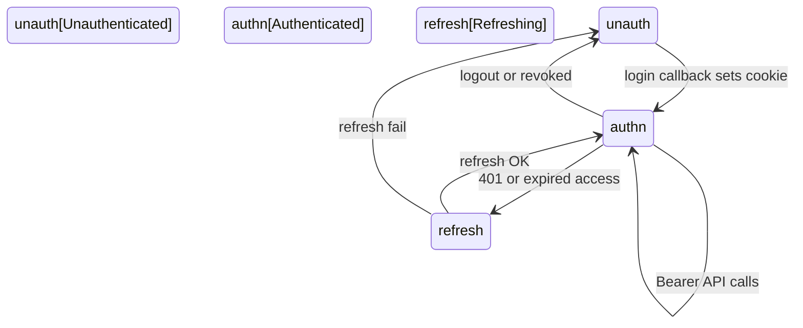

# Journeys First

## Principle

See /f-journeys.

## Artifacts

- **Fact:** [authentication.mdx](../../apps/docu/content/docs/architecture/authentication.mdx), [account-linking.mdx](../../apps/docu/content/docs/architecture/account-linking.mdx)
- **Fact:** Web gate: [`../../apps/web/proxy.ts`](../../apps/web/proxy.ts). Public: `/auth/login`, `/auth/callback/*`, `/auth/logout`, `/auth/session/revoke`, `/terms`, `/privacy`, `/images/auth-login-hero.webp`. Unauthenticated → login. Authenticated on login → `/`. Token refresh on navigation.
- **Fact:** Adopter first-success: [product-ready.mdx](../../apps/docu/content/docs/testing/product-ready.mdx) (`db:start` + `pnpm reset` + `pnpm dev` + `ALLOW_TEST` + `test@test.ai`). Not CI green. After they own the copy: [after-fork.mdx](../../apps/docu/content/docs/development/after-fork.mdx).
- **Fact:** Actors: web end user; adopting developer; CLI/agent with API key; CI/CodeRabbit/DeepSec; mobile user (**deferred**)
- **Fact:** Login methods: magic link (`token`+`verificationId` or `token`+`email`); OAuth GitHub/Google/Facebook/Twitter; passkey; Web3 EIP-155/Solana on the API. TOTP is 2FA only.
- **Fact:** E2E magic link: `test@test.ai` when `ALLOW_TEST=true`
- **Fact:** Session: access/refresh JWT, CAS rotation, `TOKEN_REUSE_DETECTED`, logout **204**. List/delete sessions JWT-only (`USE_KEY_REVOKE` for API keys). Public email revoke `POST /auth/sessions/revoke`. Cookie `api.session` (`httpOnly: false` — Security names the risk).
- **Fact:** New-device email on unmatched `deviceFingerprint` among other session rows; `WEB_APP_URL` allowlisted; Settings → Security → Sessions.
- **Fact:** Account: last-method guardrail (`LAST_SIGN_IN_METHOD`); change/link email; OAuth/wallet/passkey link; API keys `bask_` shown once.
- **Fact:** CLI: API key only; JWT auth endpoints excluded ([cli.mdx](../../apps/docu/content/docs/development/cli.mdx))
- **Drift:** Web3 verify exists on Fastify; **web has no wallet UI**. Do not map a wallet-connect journey as shipped.
- **Fact:** Assistant demo jobs (web, in-shell chat): (1) account — `getAccountInfo` + `__render: 'user-info'`; (2) markets — `getMarketSnapshot` + `__render: 'market-card'`. Entry = composer or suggestion. Completion for (1) = `accountRender: true`. Completion for (2) = market card rendered. A text-only reply is **not** either job. No GenUI CTA (`actions: {}`).
- **Unresolved:** named journey files beyond auth MDX; mobile completion

Interface:

- **Fact:** Demo shell brand is **Basilic** (sidebar). Markets home uses `@repo/ui` + `tokens.css` (`text-chart-2` / `text-destructive` for 24h change). No second palette.
- **Fact:** No Google-format `_first/DESIGN.md` yet. Do not invent a second palette. When added, use [DESIGN.md Format](https://raw.githubusercontent.com/google-labs-code/design.md/refs/heads/main/docs/spec.md) at `_first/DESIGN.md` (or one path listed in [../FIRST.md](../FIRST.md)).
- **Fact:** Tokens: [`../../packages/ui/src/styles/tokens.css`](../../packages/ui/src/styles/tokens.css) — semantic colors, sidebar, radius, `@theme inline`, Inter / Poppins / mono
- **Fact:** Components: `@repo/ui` (shadcn/ui, Radix, Tailwind 4). ADR [004](../../apps/docu/content/docs/adrs/004-design-system.mdx). Frontend: [frontend.mdx](../../apps/docu/content/docs/architecture/frontend.mdx)
- **Fact:** Apps consume `@repo/ui`; app-only UI collocated in `apps/web` / `apps/mobile` / `apps/docu`
- **Fact:** Skills: `shadcn-v3`, `tailwind-design-system-v4`, `frontend-design-v1`, `web-design-guidelines-v1`, `composition-patterns-v1`; playbooks `/use-frontend`, `/audit-accessibility`, `/use-shadcn`
- **Fact:** Browser verification is a bounded desktop + mobile screenshot pass plus keyboard — not visual-regression CI (Quality still unresolved for that)
- **Unresolved:** Google-format `_first/DESIGN.md` (do not generate from `tokens.css` until written on purpose); motion guidelines beyond existing `emilkowal-animations-v1` / `motion-v13` skills; copy patterns beyond component defaults

## Minimum Useful Artifact

- actor: web end user
- job: sign in and reach `/`
- entry: `/auth/login`
- happy path: magic link or OAuth or passkey → callback sets cookies → `/`
- alternates: code entry vs link click; OAuth 503 if provider unconfigured
- errors: invalid/expired codes, `TOKEN_REUSE_DETECTED`, `SESSION_NOT_FOUND`
- gates: proxy (web) and Fastify JWT/API key — policy in SECURITY.md
- completion: authenticated session; home loads. Wallet link after login is optional, not required.
- reuse: `@repo/ui` + `tokens.css`; browser across states

Assistant job (demo, same shape):

- actor: web end user (signed in)
- job: retrieve account context or a market snapshot in-conversation
- entry: `/` assistant chrome; suggestions “What moved?” / “Explain BTC” / “Who am I?”
- happy path: user sends a turn → `getAccountInfo` → `__render: 'user-info'` **or** `getMarketSnapshot` → `__render: 'market-card'`
- alternates: text-only assistant reply (turn completed, demo job not)
- errors: stream error; user stop
- gates: proxy + Bearer JWT
- completion: `user-info` **or** `market-card` rendered. Not “the model replied.”

## Notes

Product answers what and why. Journeys answer how someone finishes and how the interface expresses it. Security owns permission policy. Do not invent wallet-connect or mobile journeys.

**Navigation:** [Generic spec](https://github.com/blockmatic/first/blob/main/_first/principles/JOURNEYS.md) · [Human essay](https://github.com/blockmatic/first/blob/main/_first/articles/JOURNEYS.md) · [Factory map](../ABOUT.md) · [Authentication](../../apps/docu/content/docs/architecture/authentication.mdx) · [Account linking](../../apps/docu/content/docs/architecture/account-linking.mdx) · [Frontend](../../apps/docu/content/docs/architecture/frontend.mdx) · [ADR 004](../../apps/docu/content/docs/adrs/004-design-system.mdx)
