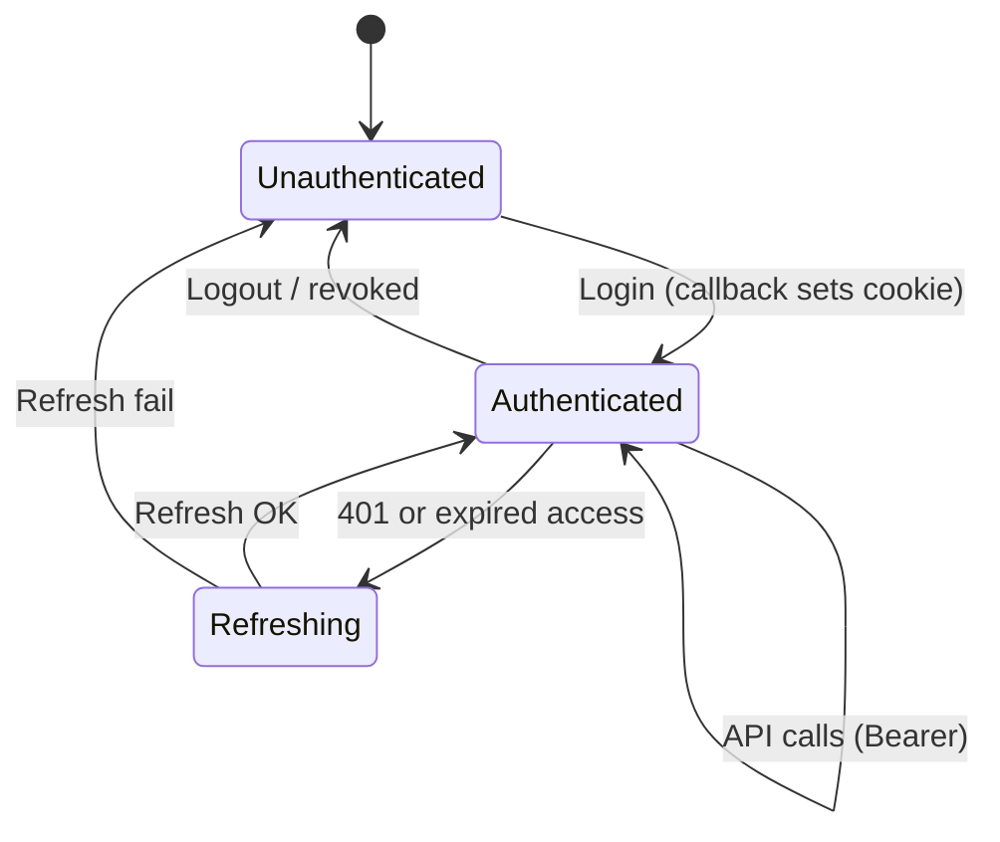

Auth lives in `apps/api` as JWT Bearer over Drizzle sessions. One token model for web, mobile, CLI, and servers. `@repo/react` is framework-agnostic (token from cookie or storage — no Next.js APIs in the package). Next.js only sets cookies on callback/logout pages and via the validated `update-tokens` adapter; API calls go to `NEXT_PUBLIC_API_URL`. The core client refreshes via `POST /auth/session/refresh` on 401.

Methods: **magic link**, **OAuth** (GitHub, Google, Facebook, Twitter), **Web3** (EIP-155 / Solana), **passkeys**, **TOTP** (2FA only — not a standalone sign-in method), **API keys** (`bask_<prefix>_<secret>`, hashed at rest). Linking (email, wallet, OAuth) is [Account linking](/docs/architecture/account-linking). Exact paths: `/reference` or [OpenAPI](/docs/development/openapi-generation).

## Tokens

- **Access JWT** (`typ=access`): `sub`, `sid`, optional `wal` for wallet sessions. Lifetime: `ACCESS_JWT_EXPIRES_IN_SECONDS`. Fastify verifies JWT then loads the session.
- **Refresh JWT** (`typ=refresh`): `sub`, `sid`, `jti`. Rotation at `POST /auth/session/refresh`. Reuse of a spent `jti` returns 401 `TOKEN_REUSE_DETECTED` and revokes the session; further refresh attempts return `SESSION_NOT_FOUND`.
- **Session**: created on login, rotated on refresh, deleted on logout (`POST /auth/session/logout` returns **204**).

`createClient` modes: no-auth, JWT (`getAuthToken` / `getRefreshToken` / `onTokensRefreshed`), API key. See [Packages](/docs/development/packages).

## Magic link verify

`POST /auth/magiclink/verify` accepts exactly one identifier:

- `{ token, verificationId }` — link-click flow (verificationId from callback URL)
- `{ token, email }` — code entry on the login page

Both/neither returns 400 `INVALID_INPUT`.

## Validate tokens

`POST /auth/session/validate-tokens` checks an access + refresh pair before Next.js writes cookies. Same-origin Next adapter only; Fastify remains issuer and revocation authority.

## Logout

`POST /auth/session/logout` (Bearer required) deletes the session row and returns **204**. Subsequent Bearer requests return 401.

## API keys

`POST /account/apikeys` returns the raw `bask_` key once. The database stores `hashToken(secret)`, not the raw key.

## Web3 callback storage

EIP-155 and Solana verify routes store short-lived callback JWTs in `web3_callback` **encrypted at rest** (AES-GCM, same helpers as passkey callbacks). `POST /auth/web3/exchange` decrypts before returning tokens to the client. Decrypt failure returns 401 `INVALID_OR_EXPIRED_CODE`.

## Web (Next.js)

Callback routes under `/auth/callback/*` exchange with Fastify, set cookies, redirect to `/`. `/auth/logout` revokes the session and clears cookies. Client-side token persistence goes through `POST /api/auth/update-tokens`, which accepts same-origin requests only and calls Fastify `POST /auth/session/validate-tokens` before writing `api.session`. After login, home includes link-wallet and link-email.

Magic link: request email → user clicks → verify → cookies. E2E uses `test@test.ai` when `ALLOW_TEST=true`. See [E2E Testing](/docs/testing/e2e-testing).

## Related

- [Account linking](/docs/architecture/account-linking)
- [Frontend](/docs/architecture/frontend) (Web3 hooks)
- [Security](/docs/architecture/security)
