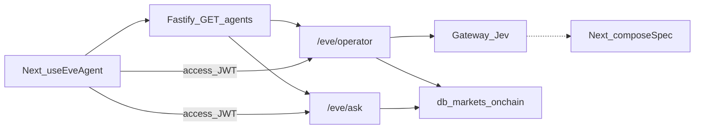

Default host is Vercel (Workflow + Sandbox) on a sibling project. Eve is the recommended **durable** agent runtime: sessions, turns, steps, Workflow, sandbox, and HTTP channels. The workspace is `apps/agents` (`@repo/agents`) with separately addressable agents `operator` and `ask` on one origin (`/eve/operator`, `/eve/ask`). Local `eve:dev` / `eve start` (Nitro `.output`) is the exit. Do not treat the `.agents/skills/eve` coding skill as the runtime; runtime skills stay inside `apps/agents`.

The scored Fastify host stays the Is Agentic product API. Do not mount `/eve/` on that URL. Discovery (`llms.txt`, `/openapi.json`, RFC 9727 catalog) does **not** advertise eve. Fastify `GET /agents` lists operator and ask origins. See [ADR 014](/docs/adrs/014-fastify-eve-vercel-runtime). Start commands and the actual HTTP paths: [apps/agents/README.md](https://github.com/blockmatic/basilic/blob/main/apps/agents/README.md). `create-basilic` includes `apps/agents` (operator and ask). Coin Tracker extends operator with board tools and Jev.

## Interaction

Fastify mints the access JWT. Eve verifies `typ=access`. Ask does not run Jev.

## Session model

Eve owns **session → turn → step**. Fastify `/ai/*` does not. Interactive streams belong here; they are not a Fastify proxy and there is no coordinator agent in front of them. Product ids are `operator` and `ask` under `agents/<name>/agent/`. The web rail uses **`useEveAgent` from `eve/react`** with `host` from Fastify `GET /agents` and an optional Bearer access JWT (`headers`). Persist the `session` cursor (`sessionId`, `streamIndex`). Do not import `eve/client` into Next (not webpack-safe). Next webpack rewrites eve’s `using` syntax in the react store so SWC can parse it. Do not wrap Next with **`withEve()`** — the frontend is a peer of `apps/agents`, not one Vercel project. Do not use AI SDK `useChat` / `DefaultChatTransport` against eve (UIMessage HTTP is not the eve NDJSON session protocol). `clientContext` on `send()` carries `boardQuery` / `viewConfig` / `elements`. Commands still have no assistant bubbles.

## Hosts

| Host | What runs |
| --- | --- |
| Default | Separate Vercel project: Workflow + Sandbox. Fastify stays Function + Fluid on its own project. This queue has not added that Vercel project. |
| Local | Root `pnpm dev` starts one Portless host (`https://agents.basilic.localhost`) after `@repo/db#db:start`. Health: `GET /eve/operator/v1/health` and `GET /eve/ask/v1/health`. Manual: `pnpm --filter @repo/agents eve:dev`. `PGLITE=false` is local Postgres. |
| Exit | `eve build` → Nitro `.output/`, then `eve start`. Ordinary Node / container. Not `vercel()` sandbox as the only self-host path. Local Workflow data is `.eve/.workflow-data`. |

On a single-member host, keep `/eve/` and `/.well-known/workflow/` un-rewritten. The workspace public mounts `/eve/operator` and `/eve/ask` are stripped before each member (local `dev-workspace.mjs`, Vercel `eve deploy`). Nitro is eve’s build and server, not Basilic’s product API and not an identity provider.

Operator and ask `defineAgent` set `build.externalDependencies` to `@repo/db`, `@electric-sql/pglite`, and `pg`. Eve must not bundle PGLite into authored modules (WASM / `eval`). `bootHost` runs from the HTTP channel, not `agent.ts`, so eve can read that list before it evaluates `@repo/db`. It is once-per-process: `eve dev` re-evaluates the compiled channel after listen, and a second eval must not construct PGLite (Node 24 V8 `Check failed: end > addr`).

## Domain logic

Eve consumes `@repo/db` **named functions**. Next.js keeps `@repo/core` HTTP clients and does not import `@repo/db`. The closed board `ViewConfig` lives in `@repo/utils/view-config`. Eve Vitest loads `@repo/utils/*` from `dist/`; after adding a utils subpath, run `pnpm --filter @repo/utils build` before `pnpm --filter @repo/agents test`. Markets, onchain, and Chat tools live in [Coin Tracker](https://github.com/blockmatic/basilic-tracker). OpenAPI to Fastify is a last resort when a function is not extractable. There is no product MCP. Operator sets `defaultTools: false`.

## Jev

`getEvaluationModel()` in `apps/agents/lib/evaluate` builds a Gateway evaluation model when `AI_GATEWAY_API_KEY` or Vercel `VERCEL_OIDC_TOKEN` is set. `evaluateBoardTurn` runs one `experimental_evaluate` over prompt plus boardQuery JSON (not coin rows). Missing credentials or Gateway 401/403/429/529, timeout, or plan-limit errors skip the hop (`skip: missing-model | upstream`). The command agent calls that result on `step.started` before the language model; high-confidence refuse/canned/surface skip the language model. Chat still does not run Jev. Command and chat language models use the same Gateway credentials via `getProvider()`.

## Identity

Fastify **mints** JWT (access, refresh, API keys). Eve is a resource, not an IdP. The HTTP channel verifies Fastify **access** JWTs (`typ=access`) via `basilicAccessJwt`, then accepts a missing Bearer as an anonymous principal (IP rate limit), then `vercelOidc()` and `localDev()`. Refresh tokens are rejected. A channel is inbound ingress plus route auth. A connection is outbound (MCP/OpenAPI to someone else) — not the same thing.

## Related

- [ADR 014: Fastify, eve, and Vercel runtime](/docs/adrs/014-fastify-eve-vercel-runtime)
- [AI](/docs/architecture/ai) — Fastify `/ai/*` as-built
- [API Architecture](/docs/architecture/api) — scored host, discovery, no MCP
- [Portability](/docs/architecture/portability)
- [Vercel Deployment](/docs/deployment/vercel)
