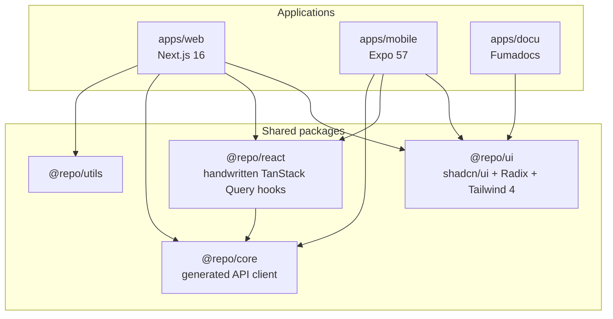
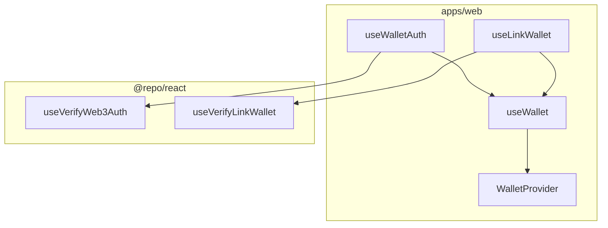

`apps/web` and `apps/mobile` consume shared UI and API types through monorepo packages. `apps/docu` uses `@repo/ui` only — it does not depend on `@repo/core` or `@repo/react`.

## Layout



- Reusable primitives → `@repo/ui`
- App-only UI → the app’s `components/` (collocated with the route)
- API types and client → `@repo/core` (generated from OpenAPI)
- React Query hooks → `@repo/react` (**handwritten**, not generated). See [OpenAPI Generation](/docs/development/openapi-generation).

## Rendering (RSC-first)

Default to Server Components. Use `'use client'` only for interactivity, browser APIs, or client-only libraries.

Stream with `loading.tsx` and Suspense. Mark search/filter updates as transitions when they would block the UI.

## Data and state

| Concern | Library |
| --- | --- |
| Server fetch | Server Components when possible |
| Client async | TanStack Query 5 via `@repo/react` |
| API client | `@repo/core` |
| Query keys | `@lukemorales/query-key-factory` for hand-written queries |
| URL state | `nuqs` (filters, tabs, pagination) |
| Grouped / persisted UI | `ahooks` (`useSetState`, `useLocalStorageState`) |
| Validation | Zod at boundaries |
| Errors | `react-error-boundary` + [Error Handling](/docs/architecture/error-handling) |

```tsx
import { createQueryKeys } from "@lukemorales/query-key-factory"
import { parseAsInteger, parseAsString, useQueryStates } from "nuqs"

export const users = createQueryKeys("users", {
  detail: (id: string) => ({
    queryKey: [id],
    queryFn: () => fetchUser(id),
  }),
})

const [filters, setFilters] = useQueryStates({
  search: parseAsString.withDefault(""),
  page: parseAsInteger.withDefault(1),
})
```

## UI

`@repo/ui` owns shadcn-style components, Radix primitives, and Tailwind 4. Import `@repo/ui/components/*`. Prototype in v0 if useful, then install into `@repo/ui` and consume from apps.

## Web3 (apps/web)

Wallet adapters live in the app (`@/hooks/`, `@/wallet/`). `@repo/react` only exposes verify/link helpers (`useVerifyWeb3Auth`, `useVerifyLinkWallet`, `useLinkEmail`). Stack: Wagmi 3 + Viem 2 + Solana wallet-adapter.

`WalletAdaptersInjector` bridges wagmi and Solana, enforces single-wallet mode, and signs out on disconnect when the session was created by a wallet. After login, `/` shows link-wallet and link-email. See [Authentication](/docs/architecture/authentication).



## Testing

Frontend apps use Playwright E2E only. See [E2E Testing](/docs/testing/e2e-testing).
