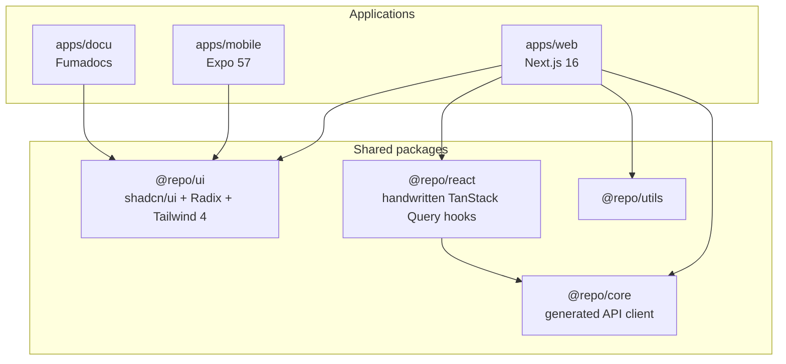

`apps/web` and `apps/mobile` consume shared UI and API types through monorepo packages. `apps/docu` uses `@repo/ui` only — it does not depend on `@repo/core` or `@repo/react`.

## Layout



- Reusable primitives → `@repo/ui`
- App-only UI → the app’s `components/` (collocated with the route)
- API types and client → `@repo/core` (generated from OpenAPI)
- React Query hooks → `@repo/react` (**handwritten**, not generated). See [OpenAPI Generation](/docs/development/openapi-generation).

## Routing

- [`proxy.ts`](/docs/architecture/authentication) is the only auth gate. Do not duplicate redirects in layouts or pages.
- Unauthenticated requests never reach the App Router 404: `apps/web/proxy.ts` redirects them to `/auth/login`. After auth, unmatched paths render `apps/web/app/not-found.tsx` with HTTP 404.
- When dynamic resource routes exist, call `notFound()` for missing resources — not inline “not found” JSX with a 200 status.
- No parallel (`@slot`) or intercepting routes until the product needs a multi-pane or modal-detail UI.
- Crawl (`apps/web` only): `app/robots.ts` allows `/privacy`, `/terms`, `/auth/login`, and `/sitemap.xml`, disallows `/`, and advertises the sitemap at `NEXT_PUBLIC_APP_URL`. `app/sitemap.ts` emits absolute `loc` URLs from that origin. Docs-host crawl policy: [Vercel Deployment — Docs host crawl](/docs/deployment/vercel#docs-host-crawl).

## Errors

`app/error.tsx` and the shared `ErrorBoundary` report via `captureError` from `@repo/error/nextjs`, same as `global-error.tsx`. See [Error Handling](/docs/architecture/error-handling).

## Rendering (RSC-first)

Default to Server Components. Use `'use client'` only for interactivity, browser APIs, or client-only libraries.

Stream with `loading.tsx` and Suspense. Mark search/filter updates as transitions when they would block the UI.

### Caching

`apps/web` uses the **legacy** Next 16 cache model: `cacheComponents` is off, so `'use cache'` is unused. Do not enable Cache Components without a migration.

- Do not export `dynamic = 'force-dynamic'` from the root layout. That sets `fetchCache: 'force-no-store'` for the route and voids fetch-level `next.revalidate`.
- [`proxy.ts`](/docs/architecture/authentication) gates requests. Cookie reads there do **not** make RSC segments dynamic. A page becomes dynamic when a Server Component calls `cookies()` (for example `getUserInfo` → `getServerAuthToken`).
- Semi-static RSC data (news, markets): `fetch` with `next: { revalidate: N }`.
- Auth / Fastify: `cache: 'no-store'`. Identical GET `fetch` calls are request-memoized; do not wrap them in `React.cache()`.
- No `revalidateTag` until something is tagged. Mutations stay on Fastify, not Server Actions.

## Mutations

Forms and hooks call the shared API client (`@repo/core`, `@repo/react`) which hits Fastify directly. Next.js routes exist only for SSR and cookie integration — auth callbacks, logout, and `POST /api/auth/update-tokens` (same-origin, Fastify-validated before `Set-Cookie`). Do not migrate login or settings mutations to `'use server'`.

Pending and optimistic UI for mutations stays on TanStack mutation flags (`isPending`, `isError`); do not rewrite forms to `useFormStatus` or `useOptimistic`.

## Data and state

| Concern | Library |
| --- | --- |
| Server fetch | Server Components when possible |
| Client async | TanStack Query 5 via `@repo/react` |
| API client | `@repo/core` |
| Query keys | Handwritten in `@repo/react` hooks and `apps/web/lib/query-keys.ts` |
| URL state | `nuqs` (filters, tabs, pagination) |
| Grouped / persisted UI | `ahooks` (`useSetState`, `useLocalStorageState`) |
| Validation | Zod at boundaries |
| Errors | `react-error-boundary` + [Error Handling](/docs/architecture/error-handling) |

### Server vs client fetch

- **RSC:** semi-static pages (news, markets) and profile (`getUserInfo` in the page, `initialData` on `useUser`).
- **Client TanStack:** settings/security (API keys, passkeys, TOTP). These surfaces are mutation-first and need WebAuthn or OTP browser APIs. Do not duplicate their GETs in Server Components; an empty first paint until hydration is accepted.

```tsx
import { parseAsInteger, parseAsString, useQueryStates } from "nuqs"

const [filters, setFilters] = useQueryStates({
  search: parseAsString.withDefault(""),
  page: parseAsInteger.withDefault(1),
})
```

## UI

`@repo/ui` owns shadcn-style components, Radix primitives, and Tailwind 4. Import `@repo/ui/components/*`. Prototype in v0 if useful, then install into `@repo/ui` and consume from apps.

## Web3 (apps/web)

The Fastify API supports Web3 auth and account linking (EIP-155 / Solana). **`apps/web` does not ship a wallet UI yet** — no wagmi, viem, or Solana wallet-adapter packages in the web app. When wallet connect ships, adapters live in the app (`@/hooks/`, `@/wallet/`) and `@repo/react` exposes verify/link helpers (`useVerifyWeb3Auth`, `useVerifyLinkWallet`, `useLinkEmail`). See [Authentication](/docs/architecture/authentication) and [Account linking](/docs/architecture/account-linking).

## Testing

Frontend apps use Playwright E2E only. See [E2E Testing](/docs/testing/e2e-testing).
