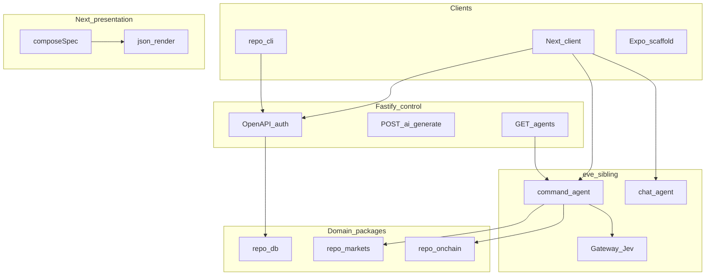

**Basilic** is a starter for Agentic Systems. Fastify is the scored API and agent-discovery host, eve is the durable agent runtime on a **sibling** project, Next.js is a typed client, and `@repo/*` packages hold domain logic. Default host is the Vercel ecosystem.

**Default host:** [Vercel](/docs/deployment/vercel) + Supabase. **Exit:** ordinary Node (`Fastify listen`, `eve start`) and PostgreSQL — see [Portability](/docs/architecture/portability).

## Four planes

| Plane | Role | Where |
| --- | --- | --- |
| **Control** | Product HTTP, OpenAPI, auth, `POST /ai/generate`, `GET /agents` metadata | `apps/api` (Fluid Function on Vercel) |
| **Interaction** | Durable command and chat agents, tools, Workflow + Sandbox | `apps/agents` (eve sibling; not on the scored Fastify URL) |
| **Domain** | DB, markets, on-chain reads — no Next imports | `@repo/db`, `@repo/markets`, `@repo/onchain` |
| **Presentation** | Next.js client, json-render specs, `@repo/core` | `apps/web` |

Why this split: agents discover and call **HTTP** on Fastify (`/openapi.json`, `/llms.txt`, RFC 9727 catalog). Interactive streams and durable turns belong on **eve**, not a Fastify proxy. Next calls `@repo/core`; it does not own the API. Detail: [AI](/docs/architecture/ai), [ADR 014](/docs/adrs/014-fastify-eve-vercel-runtime).

Machine contract for API consumers is **OpenAPI** + `@repo/core` + CLI — not product MCP ([ADR 009](/docs/adrs/009-api-architecture)).

## Topics

- [Monorepo](/docs/architecture/monorepo) — Turborepo, apps, packages
- [API](/docs/architecture/api) — Fastify 5, TypeBox, OpenAPI, `@repo/core`
- [Data](/docs/architecture/data) — Drizzle tables; `oauth_state` is a verification type
- [AI](/docs/architecture/ai) — Four planes, Fastify `/ai/generate`, composeSpec
- [Eve](/docs/architecture/eve) — Durable agent runtime in `apps/agents`
- [Authentication](/docs/architecture/authentication) — Magic link, OAuth, Web3
- [Account linking](/docs/architecture/account-linking) — Email change, OAuth, wallets
- [Frontend](/docs/architecture/frontend) — Next.js 16, json-render board, custom wallet modal (optional login; not required for Product Ready)
- [Error handling](/docs/architecture/error-handling) — `@repo/error`, log-only capture (Sentry installed, inactive)
- [Logging](/docs/architecture/logging) — Pino / console, `reqId`
- [Product analytics](/docs/architecture/analytics) — PostHog chosen, not shipped; web instrumented, not collected
- [Security](/docs/architecture/security) — Secrets, CVE scans, DeepSec
- [ESM & TypeScript](/docs/architecture/esm-strategy) — TypeScript 7, dual-mode exports
- [Portability](/docs/architecture/portability) — shipped Vercel + Supabase; GCP/AWS not first-class

Decisions: [ADRs](/docs/adrs).
