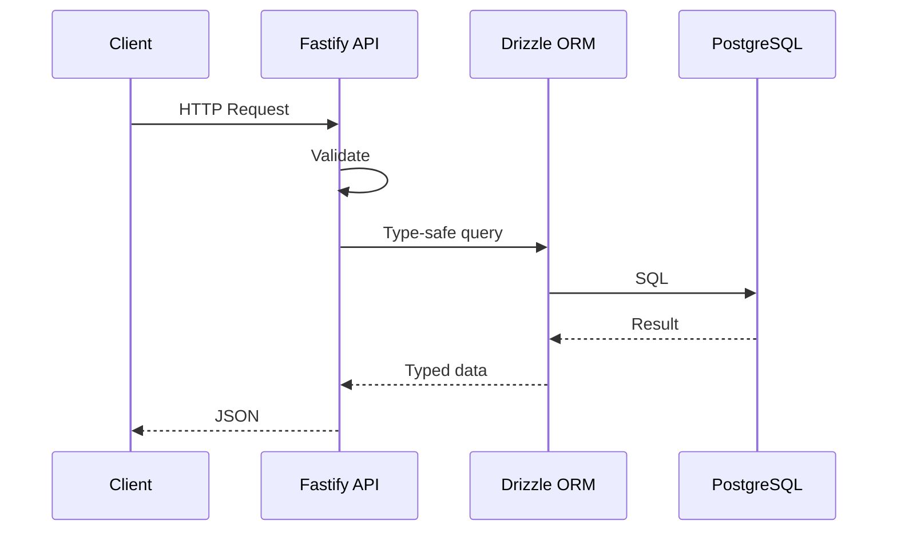

Principles: composability, API as source of truth, multiple clients, no vendor lock-in, tooling with long-term support.

## Topics

- [Monorepo](/docs/architecture/monorepo) — Turborepo, apps, packages
- [API](/docs/architecture/api) — Fastify 5, TypeBox, OpenAPI, `@repo/core`
- [AI](/docs/architecture/ai) — Providers, `/ai/chat`, `/ai/generate`, web assistant
- [Authentication](/docs/architecture/authentication) — Magic link, OAuth, Web3
- [Account linking](/docs/architecture/account-linking) — Email change, OAuth, wallets
- [Frontend](/docs/architecture/frontend) — Next.js 16, React 19, Tailwind 4, Web3 hooks
- [Error handling](/docs/architecture/error-handling) — `@repo/error`, log-only capture (Sentry installed, inactive)
- [Logging](/docs/architecture/logging) — Pino / console, `reqId`
- [Product analytics](/docs/architecture/analytics) — PostHog chosen, not shipped
- [Security](/docs/architecture/security) — Secrets, CVE scans, DeepSec
- [ESM & TypeScript](/docs/architecture/esm-strategy) — TypeScript 7, dual-mode exports
- [Portability](/docs/architecture/portability) — Host anywhere

Decisions: [ADRs](/docs/adrs).
