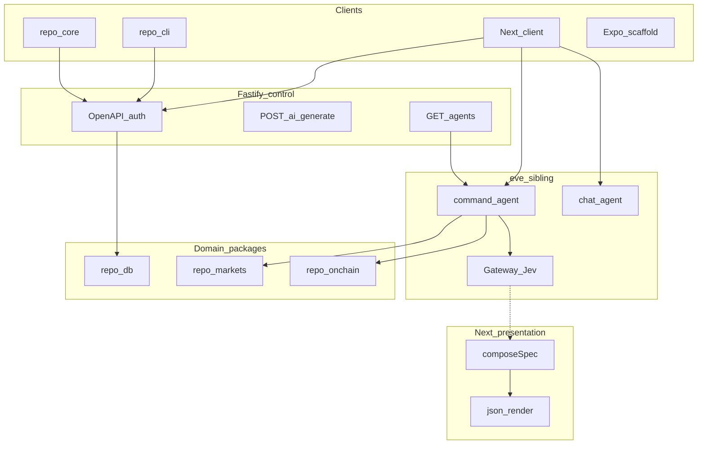

Basilic is an API-first foundation for agentic products. The Fastify HTTP API is the product boundary. Web, CLI, generated clients, and durable agents operate against that contract. There is no product MCP. Expo is a UI scaffold and does not call the API yet.

Humans and agents are both clients. Session JWTs serve the browser. API keys serve the CLI, scripts, and other machine callers. eve hosts durable `command` and `chat` on a sibling origin. Generative UI is presentation tooling: Jev triages command turns, Next `composeSpec` authors json-render specs, and `@repo/ui` (shadcn/Base UI) is the catalog the renderer paints.

**Default host:** [Vercel](/docs/deployment/vercel) + Supabase. **Exit:** ordinary Node (`Fastify listen`, `eve start`) and PostgreSQL — see [Portability](/docs/architecture/portability).

`create-basilic` omits `apps/agents`. Clone this repository for the full agent stack.

## Four planes

| Plane | Role | Where |
| --- | --- | --- |
| **Control** | Product HTTP, OpenAPI, auth, `POST /ai/generate`, `GET /agents` metadata | `apps/api` (Fluid Function on Vercel) |
| **Interaction** | Durable command and chat agents, tools, Workflow + Sandbox | `apps/agents` (eve sibling; not on the scored Fastify URL) |
| **Domain** | DB, markets, on-chain reads — no Next imports | `@repo/db`, `@repo/markets`, `@repo/onchain` |
| **Presentation** | Next.js client, Generative UI (json-render + `@repo/ui`), `@repo/core` | `apps/web` |

Agents discover and call **HTTP** on Fastify (`/openapi.json`, `/llms.txt`, RFC 9727 catalog). Interactive streams and durable turns belong on **eve**, not a Fastify proxy. Next calls `@repo/core`; it does not own the API. Detail: [AI](/docs/architecture/ai), [ADR 014](/docs/adrs/014-fastify-eve-vercel-runtime).

The machine contract for API consumers is **OpenAPI** + `@repo/core` + CLI — not product MCP ([ADR 009](/docs/adrs/009-api-architecture)).

## Capabilities

Canonical names. Docu homepage and the root README summarize this set.

### Product contract

| Capability | Status | Detail |
| --- | --- | --- |
| Product API | Available | Typed REST, OpenAPI, discovery. [API](/docs/architecture/api) |
| Multi-client auth | Available | Session JWT, API keys, OAuth, passkey, magic link, SIWE/SIWS. [Authentication](/docs/architecture/authentication) |
| Generated clients | Available | `@repo/core` from OpenAPI; handwritten `@repo/react` hooks. [OpenAPI generation](/docs/development/openapi-generation) |

### Agentic surfaces

| Capability | Status | Detail |
| --- | --- | --- |
| Durable agents | Available in this repo; omitted from `create-basilic` | eve `command` and `chat`. [Eve](/docs/architecture/eve) |
| Generative UI | Available (LLM keys optional; fallbacks exist) | Jev + json-render + shadcn/Base UI. [AI](/docs/architecture/ai) |
| API CLI | Available (workspace) | `basilic` binary; API key; JSON stdout. [CLI](/docs/development/cli) |
| Coding-agent contract | Available | `AGENTS.md`, `/w-*`, lock-installed skills. [AI workflow](/docs/development/ai-workflow) |

### Human clients

| Capability | Status | Detail |
| --- | --- | --- |
| Web client | Available | Next.js on the API; host for Generative UI. [Frontend](/docs/architecture/frontend) |
| Mobile | Experimental | Expo UI scaffold; not an API client. [Frontend](/docs/architecture/frontend) |
| End-to-end TypeScript | Available | Schema → OpenAPI → generated clients. [Data](/docs/architecture/data) |

### How you ship

| Capability | Status | Detail |
| --- | --- | --- |
| Deploy | Available | Vercel + Supabase default; Node/Postgres exit. [Portability](/docs/architecture/portability) |
| Quality and security | Available | Biome, hooks, Gitleaks, OSV, DeepSec. [Security](/docs/architecture/security) |
| Multichain | Available (optional) | SIWE/SIWS, wallet modal, Alchemy reads; not send/swap. [Authentication](/docs/architecture/authentication) |

## Topics

- [Monorepo](/docs/architecture/monorepo) — Turborepo, apps, packages
- [API](/docs/architecture/api) — Fastify 5, TypeBox, OpenAPI, `@repo/core`
- [Data](/docs/architecture/data) — Drizzle tables; `oauth_state` is a verification type
- [AI](/docs/architecture/ai) — Four planes, Fastify `/ai/generate`, Generative UI
- [Eve](/docs/architecture/eve) — Durable agent runtime in `apps/agents`
- [Authentication](/docs/architecture/authentication) — Magic link, OAuth, Web3
- [Account linking](/docs/architecture/account-linking) — Email change, OAuth, wallets
- [Frontend](/docs/architecture/frontend) — Next.js 16, Generative UI host, wallet modal
- [Error handling](/docs/architecture/error-handling) — `@repo/error`, log-only capture (Sentry installed, inactive)
- [Logging](/docs/architecture/logging) — Pino / console, `reqId`
- [Product analytics](/docs/architecture/analytics) — PostHog chosen, not shipped; web instrumented, not collected
- [Security](/docs/architecture/security) — Secrets, CVE scans, DeepSec
- [ESM & TypeScript](/docs/architecture/esm-strategy) — TypeScript 7, dual-mode exports
- [Portability](/docs/architecture/portability) — shipped Vercel + Supabase; GCP/AWS not first-class

Decisions: [ADRs](/docs/adrs).
