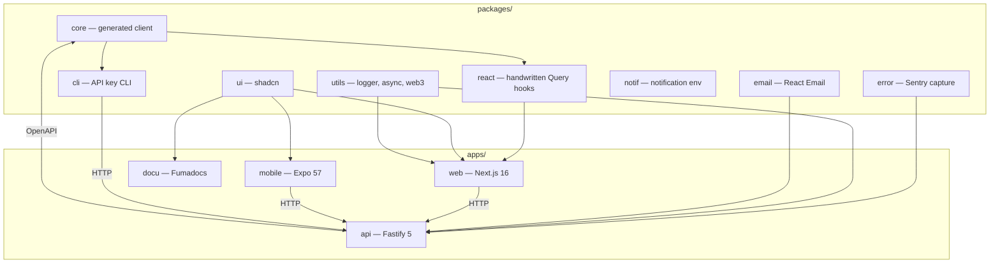

One repository, Turborepo task graph, pnpm workspaces. Rationale: [ADR 001](/docs/adrs/001-monorepo-vs-standalone). Tooling: [Development Tooling](/docs/development/dev-tooling). Conventions: [Package Conventions](/docs/development/package-conventions), [File Organization](/docs/development/file-organization).

**Apps:** `api` (Fastify), `web` (Next.js 16), `mobile` (Expo 57 UI scaffold — shared `@repo/ui` only, not wired to `@repo/core`/`@repo/react` yet), `docu` (Fumadocs).

**Packages:** `core` (generated, no app runtime), `react` (handwritten hooks on core), `ui`, `email`, `notif` (unused scaffold), `error`, `utils`, `cli`.

Dependency rule: `core` → `react`; apps depend on packages, never the reverse. Pattern A packages import `src/` in the workspace; Pattern B Node consumers (Fastify, serverless) use `dist/`. `prepack` switches to `dist/` for npm. See [Publishing](/docs/deployment/publishing) and [ESM & TypeScript](/docs/architecture/esm-strategy).
