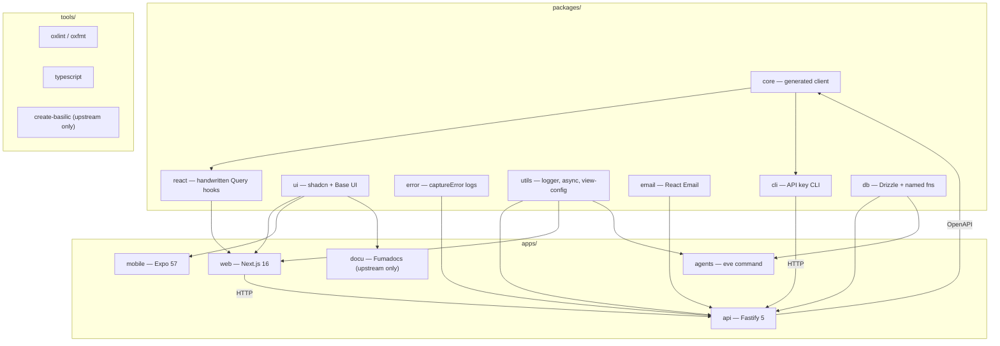

This Git repository is one pnpm workspace: the Basilic starter, Doku, and `create-basilic`. Generated projects copy that workspace without Doku and without the generator. Coin Tracker is a separate repository: [blockmatic/basilic-tracker](https://github.com/blockmatic/basilic-tracker). Rationale: [ADR 001](/docs/adrs/001-monorepo-vs-standalone) and [ADR 016](/docs/adrs/016-standalone-repos). Tooling: [Development Tooling](/docs/development/dev-tooling). Conventions: [Package Conventions](/docs/development/package-conventions), [File Organization](/docs/development/file-organization).

```mermaid
flowchart TB
  subgraph Packages["packages/"]
    Core["core — generated client"]
    React["react — handwritten Query hooks"]
    UI["ui — shadcn + Base UI"]
    Error["error — captureError logs"]
    Utils["utils — logger, async, view-config"]
    Email["email — React Email"]
    Cli["cli — API key CLI"]
    Db["db — Drizzle + named fns"]
  end

  subgraph Apps["apps/"]
    API["api — Fastify 5"]
    Web["web — Next.js 16"]
    Mobile["mobile — Expo 57"]
    Agents["agents — eve command"]
    Docu["docu — Fumadocs (upstream only)"]
  end

  subgraph Tools["tools/"]
    Oxlint["oxlint / oxfmt"]
    Ts["typescript"]
    Create["create-basilic (upstream only)"]
  end

  API -->|OpenAPI| Core
  Core --> React
  Core --> Cli
  React --> Web
  UI --> Web
  UI --> Mobile
  UI --> Docu
  Error --> API
  Utils --> API
  Utils --> Web
  Utils --> Agents
  Email --> API
  Db --> API
  Db --> Agents
  Web -->|HTTP| API
  Cli -->|HTTP| API
```

**Apps:** `api` (Fastify), `web` (Next.js 16), `mobile` (Expo 57 UI scaffold), `agents` (eve `command`; chat is Coin Tracker), `docu` (Fumadocs, not copied into generated projects).

**Tools:** `typescript` (copied), root Ultracite configs (`oxlint.config.ts`, `oxfmt.config.ts`), `create-basilic` (generator; excluded from generated projects). See [ADR 012](/docs/adrs/012-scaffolding-and-releases).

**Packages:** `core` (generated, no app runtime), `react` (handwritten hooks on core), `ui`, `email`, `error`, `utils`, `cli`, `db` (Drizzle schema + named fns; Fastify + eve host). Markets and onchain packages live in Coin Tracker.

Dependency rule: `core` → `react`; apps depend on packages, never the reverse. Pattern A packages import `src/` in the workspace; Pattern B Node consumers (Fastify, serverless) use `dist/`. `prepack` switches to `dist/` for npm. See [Publishing](/docs/deployment/publishing) and [ESM & TypeScript](/docs/architecture/esm-strategy).
