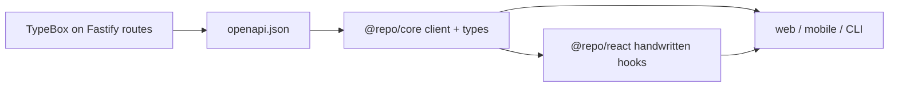

TypeBox on Fastify routes is the source of truth. Generate OpenAPI, then the `@repo/core` client. Add TanStack Query hooks in `@repo/react` by hand when the UI needs them. There is no `packages/react/src/gen/` and no Hey API React plugin in this repo.



## Commands

```bash
pnpm --filter @repo/api generate:openapi   # apps/api/openapi/openapi.json
pnpm --filter @repo/core generate          # packages/core/src/gen/
```

Spec also served at `/reference/openapi.json`; Scalar UI at `/reference`. Config: `packages/core/openapi-ts.config.ts`.

## New endpoint

1. Add the route + TypeBox schema in `apps/api/src/routes/` (one file per endpoint).
2. `pnpm --filter @repo/api generate:openapi`
3. `pnpm --filter @repo/core generate`
4. If the UI needs a hook, add it under `packages/react/src/hooks/` and export from `packages/react/src/index.ts`.

```typescript
import { createClient } from '@repo/core'
import { useUser } from '@repo/react'

const client = createClient({
  baseUrl: process.env.NEXT_PUBLIC_API_URL!,
  getAuthToken: async () => session?.token,
  getRefreshToken: async () => session?.refreshToken,
  onTokensRefreshed: async ({ token, refreshToken }) => { /* persist */ },
})

const user = await client.auth.session.user()
const { data } = useUser()
```

See [API Architecture](/docs/architecture/api) and [Package Conventions](/docs/development/package-conventions).
