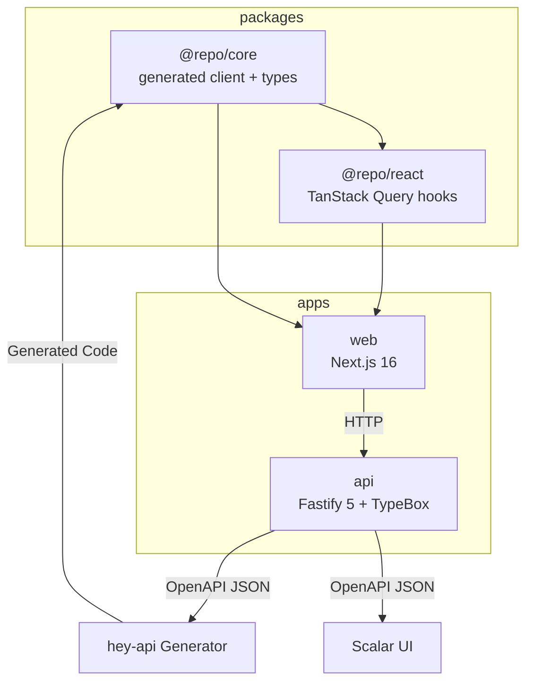

Fastify routes and TypeBox schemas are the API source of truth. OpenAPI is generated from routes; `@repo/core` owns the generated client and types; `@repo/react` is handwritten TanStack Query on top of core (no UI). Design: [API Architecture](/docs/architecture/api). Commands: [OpenAPI Generation](/docs/development/openapi-generation).

## Workspace layout

This repository is a pnpm workspace with these top-level groups:

```text
apps/       # product apps (Next.js, Fastify, docs site)
packages/   # shared libraries published as @repo/*
tools/      # shared tooling (eslint, typescript config, etc.)
```

## Package layout

```
packages/
  core/        # generated client + types (runtime-agnostic)
  react/       # handwritten TanStack Query hooks (built on core)
apps/
  api/         # Fastify 5 + TypeBox routes → generates OpenAPI
  web/         # Next.js 16 consuming core/react
```

### Dependency direction (strict)

- `@repo/core` → owns generated code, exports API types
- `@repo/react` → depends on `@repo/core` (and React/TanStack Query via peer deps)

No reverse dependencies.

## Mermaid architecture diagram



## Package responsibilities (high level)

### 1) API contracts (TypeBox → OpenAPI)

The **HTTP boundary** is defined by Fastify route schemas (TypeBox). The OpenAPI spec is a **generated artifact**.

**What goes here**

* Route schemas + handlers in `apps/api/src/routes/`
* Generated OpenAPI 3.0 file at `apps/api/openapi/openapi.json` (do not hand-edit)
* Served OpenAPI JSON at `/reference/openapi.json` and Scalar UI at `/reference`

See **[OpenAPI Generation](/docs/development/openapi-generation)** for the exact workflow.

### 2) `packages/core`

The **runtime-agnostic** client package with generated OpenAPI client code and types.

**What goes here**

- Generated TypeScript client code from the OpenAPI spec (via `@hey-api/openapi-ts`)
- Types generated from OpenAPI (no generated Zod schemas)
- `createClient()` wrapper (see `packages/core/README.md`)

**Hard rules**

- No React or TanStack Query in `@repo/core`
- Generated code lives in `packages/core/src/gen/`
- OpenAPI types are re-exported from `@repo/core`

### 3) `packages/react`

React-only helpers using **TanStack Query**.

**What goes here**

- React Query hooks that call `@repo/core` (handwritten)
- Shared provider/context to supply a core client instance to hooks
- Hooks and helpers only — no UI. UI lives in apps, collocated by route

**Hard rules**

- Hooks and helpers only — never UI in `@repo/react`
- `@tanstack/react-query` is a peer dependency

## Import and export conventions

### Use only public entrypoints

- Import from the package root or an exported subpath.
- Never deep-import internal files (e.g. `@repo/core/src/...`).
- See **[Packages Reference](/docs/development/packages)** for the canonical list of entrypoints.

For `@repo/utils`, prefer subpath imports even though a root barrel exists:

```ts
import { delay } from '@repo/utils/async'
import { logger } from '@repo/utils/logger/server'
import { getErrorMessage } from '@repo/error'
```

## Dependency management strategy

Pick dependency types based on *who should own the version*:

- **App/framework deps → peerDependencies**: React, React DOM, TanStack Query, Next.js, etc.
- **Tightly-coupled internal deps → dependencies**: shared UI building blocks, generated code wrappers.
- **Optional integrations → optional peerDependencies**: e.g. Sentry SDKs.

Rule of thumb:

```text
If the consumer must control it → peerDependency
If the library cannot function without it → dependency
If it is used only in dev/test/build → devDependency
```

Also: list peer deps in `devDependencies` too so the package type-checks and tests in isolation.

## Adding a new API endpoint (checklist)

When you add or change an endpoint:

1. Add/update the Fastify route + TypeBox schemas in `apps/api/src/routes/**`
2. Regenerate OpenAPI: `pnpm --filter @repo/api generate:openapi`
3. Regenerate the core client: `pnpm --filter @repo/core generate`
4. If you want a React Query wrapper, add/update a hook in `packages/react/src/hooks/`
5. Consume the types from `@repo/core` (single source of truth)

## Multi-language SDKs

TypeScript uses `@hey-api/openapi-ts`. Other languages generate from the same OpenAPI spec when needed.

ESM, dual-mode exports, and TypeScript 7: [ESM & TypeScript Strategy](/docs/architecture/esm-strategy).

## Related

- **[File Organization](/docs/development/file-organization)**
- **[Packages Reference](/docs/development/packages)**
- **[OpenAPI Generation](/docs/development/openapi-generation)**
- **[API Architecture](/docs/architecture/api)**
- **[ESM & TypeScript Strategy](/docs/architecture/esm-strategy)**
