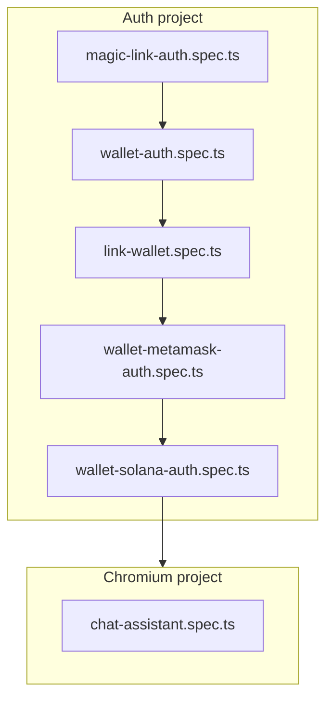

End-to-end tests run full user flows using Playwright. Two suites: **Next E2E** (apps/next) tests the web app + auth; **Fastify E2E** (apps/fastify) tests Scalar UI login. Both use `test@test.ai` for magic-link when `ALLOW_TEST=true`.

**Root QA**: `pnpm qa` runs the full pipeline (install → checktypes → lint → build → test) and ends with `pnpm test:e2e`, which runs Fastify E2E then Next E2E via `scripts/run-e2e.mjs` (both use `test:e2e:local` to spawn servers). The E2E script kills any processes on ports 3000 and 3001 before starting (unless `SKIP_KILL_PORTS=1`).

## Commands

| Command | Description |
|---------|-------------|
| `pnpm test:e2e` (root) | Run Fastify API E2E, then Next E2E (spawns local servers) |
| `pnpm test:e2e` (in apps/next) | Run E2E; expects URLs via env or `--app`/`--api` params |
| `pnpm test:e2e:local` (in apps/next) | Build (unless `SKIP_BUILD=1`), spawn Fastify + Next, poll until healthy, run tests, cleanup |
| `pnpm test:e2e` (in apps/fastify) | Run E2E; expects API URL via env or `--api` param |
| `pnpm test:e2e:local` (in apps/fastify) | Spawn API, poll until healthy, run tests, cleanup |
| `pnpm test:e2e:ui` (in apps/next or apps/fastify) | Run with Playwright UI |
| `pnpm test:e2e:debug` (in apps/next or apps/fastify) | Run in debug mode |

## URL Configuration

`test:e2e` accepts URL params. Next: `--app` and `--api`. Fastify: `--api` only. Params override environment variables.

```bash
# Next (both app and API)
pnpm test:e2e --app=https://my-app.vercel.app --api=https://my-api.vercel.app
pnpm test:e2e -- --app https://localhost:3000 --api https://localhost:3001

# Fastify (API only)
pnpm test:e2e --api=https://my-api.vercel.app
pnpm test:e2e -- --api https://localhost:3001

# Environment (defaults when no params)
PLAYWRIGHT_APP_URL=https://... PLAYWRIGHT_API_URL=https://... pnpm test:e2e
```

Defaults: Next `NEXT_PUBLIC_APP_URL` or `http://localhost:3000`; API `NEXT_PUBLIC_API_URL` or `http://localhost:3001`.

## Local Development

1. **Full suite** (root): `pnpm test:e2e` — runs Fastify E2E then Next E2E (both spawn servers, poll, run, cleanup).
2. **Next only**: `pnpm --filter @repo/next test:e2e:local` — builds, spawns Fastify + Next, runs Next E2E, cleanup.
3. **Fastify only**: `pnpm --filter @repo/fastify test:e2e:local` — spawns API, runs Scalar login E2E, cleanup.
4. **Manual** (two terminals): Build with `pnpm --filter @repo/next build:e2e`, run `pnpm --filter @repo/next start:e2e:servers` in one terminal and `pnpm --filter @repo/next test:e2e` in another.
5. **External URLs**: Use `--app` and `--api` (Next) or `--api` (Fastify) to target already-running servers or Vercel previews.

## Test Email (test@test.ai)

Magic-link E2E tests use `test@test.ai` when `ALLOW_TEST=true`. The token is stored in the database (`verification.token_plain`) and read from `/test/magic-link/last`. No fake outbox; works with Vercel serverless (shared DB across instances).

- **Local**: `test:e2e:local` and `start:ci` set `ALLOW_TEST=true`.
- **Vercel previews**: Set `ALLOW_TEST=true` for the Preview environment in project env vars.

## CI

The `next-e2e.yml` and `api-e2e.yml` workflows run on pull requests (open and sync). Both use `test:e2e:local`—no Vercel deploys. Build once, then unit tests, then E2E against local servers.

- **API E2E** — Runs when `api` scope changes. Spawns Fastify locally, runs Playwright.
- **Next E2E** — Runs when `next` scope changes. Spawns Fastify + Next locally, runs Playwright.

## Vercel Deployment Protection (Manual Testing)

To run E2E manually against Vercel preview deployments with Deployment Protection enabled:

When Deployment Protection is enabled:
1. **Protection Bypass for Automation**: In each project (Next, Fastify): Settings → Deployment Protection → Protection Bypass for Automation → enable → generate secret.
2. Use the same bypass secret for both projects.
3. Add `VERCEL_AUTOMATION_BYPASS_SECRET` to GitHub secrets.
4. Playwright adds `x-vercel-protection-bypass` and `x-vercel-set-bypass-cookie` headers automatically when the env var is set.
5. **OPTIONS Allowlist** (for CORS): In Fastify project, Deployment Protection → OPTIONS Allowlist → add `/` or `/auth` so CORS preflight succeeds.

See [Vercel Protection Bypass for Automation](https://vercel.com/docs/security/deployment-protection/methods-to-bypass-deployment-protection/protection-bypass-automation).

## Environment Variables

- **Chat E2E** (chat-assistant.spec.ts): Requires `OPEN_ROUTER_API_KEY`. Local: add to `apps/fastify/.env.test`. CI: set in GitHub secrets; `test:e2e:local` passes `process.env` and `.env.test` to the Fastify server. Currently skipped: `getAuthToken` returns null for the chat transport in E2E. `loginAsTestUserWithTokenInjection` and `/api/auth/test-set-session` (ALLOW_TEST only) exist for session injection when cookie propagation from magic-link verify fails.
- **E2E CI**: Uses local servers only; no Vercel URLs. For manual testing against previews, pass `--app`/`--api` URLs.

## ALLOW_TEST

`ALLOW_TEST=true` enables:

- Fake email for `@test.ai` (no Resend)
- DB-backed token storage for `/test/magic-link/last`
- Production guard: server exits if `ALLOW_TEST` is true in production

## Next E2E Specs

| Spec | Coverage |
|------|----------|
| `magic-link-auth.spec.ts` | Magic link login, invalid/expired token errors, email validation, protected route, JWT session |
| `wallet-auth.spec.ts` | Wallet login UI, magic link flow to dashboard, sign-out redirect |
| `link-wallet.spec.ts` | Link wallet section visibility when authenticated |
| `wallet-metamask-auth.spec.ts` | EVM wallet sign-in via mock; skipped (mock connect flow incomplete) |
| `wallet-solana-auth.spec.ts` | Solana wallet sign-in via mock; skipped (sign-in does not redirect) |
| `chat-assistant.spec.ts` | Chat UI with authenticatedPage; Who am I? prompt (skipped until getAuthToken fixed) |

### Project order



### Disabled / skipped specs

link-email excluded via testIgnore. chat-assistant, wallet-metamask-auth, wallet-solana-auth use test.describe.skip (chat: getAuthToken; wallet mocks: connect/sign-in flow incomplete).

## Troubleshooting

- **Port in use**: `scripts/run-e2e.mjs` kills processes on 3000/3001 before E2E. If ports remain in use, run `bash scripts/kill-test-servers.sh` manually.
- **Tests fail with unreachable URLs**: Ensure both servers are running, or pass correct `--app` / `--api` URLs.
- **Token extraction fails**: Verify `ALLOW_TEST=true` and email is `test@test.ai`.
- **Vercel CORS errors**: Add `/` or `/auth` to OPTIONS Allowlist in Fastify Deployment Protection.
- **Protection bypass not working**: Ensure `VERCEL_AUTOMATION_BYPASS_SECRET` matches the secret in both Vercel projects.

## Related

- [Frontend Testing](/docs/testing/frontend-testing) - Unit and integration patterns
- [GitHub Actions](/docs/deployment/github-actions) - CI workflow
- [Vercel Deployment](/docs/deployment/vercel) - Preview deployment and env vars
