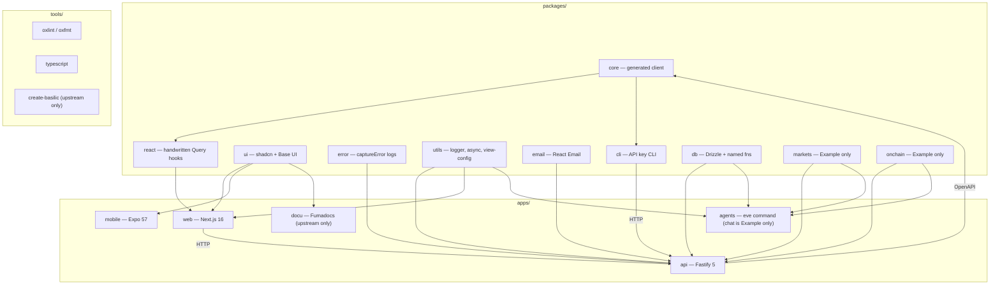

The Git repository holds two pnpm workspaces. `base/` is this starter (and Doku). `example/` is Coin Tracker, with markets, onchain, wallet auth, and chat. Generated projects copy `base/` without Doku. Rationale: [ADR 001](/docs/adrs/001-monorepo-vs-standalone) and [ADR 015](/docs/adrs/015-base-example-split). Tooling: [Development Tooling](/docs/development/dev-tooling). Conventions: [Package Conventions](/docs/development/package-conventions), [File Organization](/docs/development/file-organization).

**Apps:** `api` (Fastify), `web` (Next.js 16), `mobile` (Expo 57 UI scaffold — shares **tokens** later, not components/`@repo/core` types yet), `agents` (eve `command`/`chat` sibling; not scored; not copied by `create-basilic` yet), `docu` (Fumadocs, not copied into generated projects).

**Tools:** `typescript` (copied), root Ultracite configs (`oxlint.config.ts`, `oxfmt.config.ts`), `create-basilic` (generator; excluded from generated projects). See [ADR 012](/docs/adrs/012-scaffolding-and-releases).

**Packages:** `core` (generated, no app runtime), `react` (handwritten hooks on core), `ui`, `email`, `error`, `utils` (`@repo/utils/view-config` is the closed board ViewConfig), `cli`, `db` (Drizzle schema + named fns; Fastify + eve host), `markets` (CoinGecko + Binance; Fastify + eve host), `onchain` (Alchemy Portfolio; Fastify + eve host).

Dependency rule: `core` → `react`; apps depend on packages, never the reverse. Pattern A packages import `src/` in the workspace; Pattern B Node consumers (Fastify, serverless) use `dist/`. `prepack` switches to `dist/` for npm. See [Publishing](/docs/deployment/publishing) and [ESM & TypeScript](/docs/architecture/esm-strategy).
