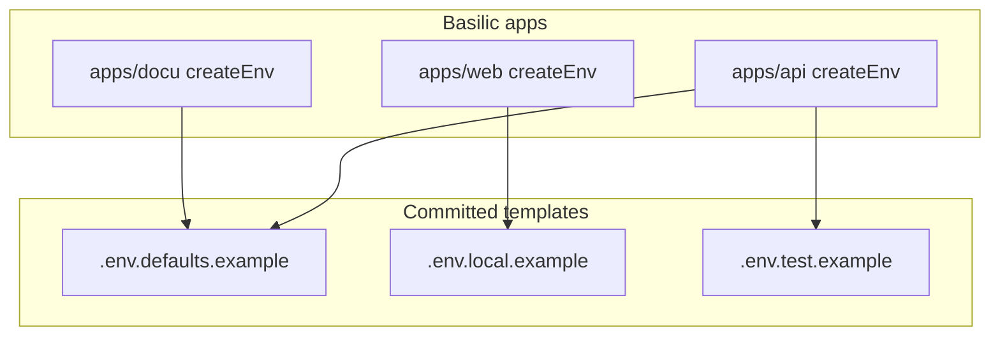

# Basilic: env file harmonization (vencura patterns)

## Goals

- **Naming**: Committed templates use **`.env.<qualifier>.example`** only (Cursor: `@**/.env.*.example`); retire **`.env-sample`**, bare **`.env.example`**, and **`.env-example`** as primary names.
- **Truth source**: Each app’s **`createEnv`** in `apps/web/lib/env.ts`, `apps/api/src/lib/env.ts`, `apps/docu/lib/env.ts` drives template variables and section order.
- **Next.js layout**: `apps/web/.env.local.example`, `.env.development`, `.env.staging`, `.env.production` share the same section headers: client `NEXT_PUBLIC_*`, server-only, E2E/Playwright, optional Sentry.
- **Tooling/docs**: Align `scripts/block-secret-files.mjs`, `.gitleaks.toml`, `.trufflehogignore`, and docu (`development/index.mdx`, `architecture/security.mdx`, etc.) with the new pattern.
- **Cursor**: Add `.cursor/rules/base/env-files.mdc` with `glob: "**/.env.*.example"` (copy from vencura after that work landed).

## Assumptions

- Basilic **web `env.ts` has no `NEXT_PUBLIC_DYNAMIC_*`** today—templates must match the **actual** schema; add Dynamic keys only if `createEnv` gains them.
- **E2E**: `apps/web/e2e/` has no `auth.setup.ts` (unlike vencura); still document **`PLAYWRIGHT_APP_URL`**, **`PLAYWRIGHT_API_URL`**, **`NEXT_PUBLIC_APP_URL`**, **`VERCEL_AUTOMATION_BYPASS_SECRET`** in `.env.local.example` for Playwright and `scripts/run-e2e.mjs`.
- **`apps/mathler`** is currently a **stub** (only `.env`, `.next`, `node_modules`, `next-env.d.ts`—no `package.json`). Full mathler env parity waits until the app is restored or the directory is removed.

## Current gaps

| Area | Today | Action |
|------|--------|--------|
| API template | `apps/api/.env-sample` (hyphen), incomplete vs `src/lib/env.ts` | Add **`apps/api/.env.defaults.example`** (full sectioned superset, placeholders); **remove** `.env-sample`; align **`apps/api/.env.test.example`** section headers with defaults |
| Web dev env | `apps/web/.env.development` uses **`LOG_ENABLED` / `LOG_LEVEL`** | Use **`NEXT_PUBLIC_LOG_ENABLED` / `NEXT_PUBLIC_LOG_LEVEL`** (matches `apps/web/lib/env.ts`) |
| Web local example | Missing `NEXT_PUBLIC_API_URL`, E2E block, optional Sentry | Expand `.env.local.example` like vencura, **omit** Dynamic unless in schema |
| Mobile | `apps/mobile/.env.example` | Rename to **`.env.defaults.example`**; update README + docu |
| Docu | `apps/docu/.env.development` is `PORT` only | Add **`NEXT_PUBLIC_SITE_URL`** per `apps/docu/lib/env.ts`; optional **`apps/docu/.env.defaults.example`** |
| Allowlists | `.env-example`, `.env.sample`, `.env-sample`, explicit `.env.local.example` | Single pattern **`/\.env\.[^/]+\.example$/`** (block-secret-files + gitleaks); adjust **`.trufflehogignore`** (e.g. `.*\.env\.[^/]+\.example$`; `.*\.example$` may already cover templates) |
| Mathler stub | Stray `apps/mathler/.env` | **Decide**: delete stub tree or restore full app from vencura; avoid new committed templates under an empty app |

## Implementation order

1. **Cursor rule** — Add `.cursor/rules/base/env-files.mdc` (mirror vencura’s rule body).
2. **Tooling** — `block-secret-files.mjs`, `.gitleaks.toml`, `.trufflehogignore`.
3. **API** — `.env.defaults.example` + `.env.test.example`; delete `.env-sample`; update `apps/api/README.md` and `apps/docu/content/docs/development/index.mdx` (replace `fastify/.env-sample`).
4. **Web** — `.env.local.example`, `.env.development`, `.env.staging`, `.env.production`.
5. **Mobile + docu** — `.env.defaults.example`, docu env files.
6. **READMEs** — `apps/web/README.md`, `apps/mobile/README.md`, `scripts/README.md` if they mention old template names.
7. **Mathler** — Resolve stub (remove from repo or restore package).
8. **Verify** — `pnpm qa` (or checktypes + lint + tests); confirm pre-commit allows new template paths.

## Diagram

## References

- **Reference implementation**: `/home/gabo/code/vencura` (post–env harmonization): `apps/api/.env.defaults.example`, `.cursor/rules/base/env-files.mdc`, `scripts/block-secret-files.mjs`, web/mathler/mobile/docu env files.
- `@.cursor/rules/cursor/rules.mdc` (basilic) — rule file style.
- `@.cursor/rules/base/general.mdc` (basilic) — env in `lib/env.ts`, t3-oss.

## Todo checklist

- [x] Add `.cursor/rules/base/env-files.mdc`
- [x] Update `block-secret-files.mjs`, `.gitleaks.toml`, `.trufflehogignore`
- [x] API: `.env.defaults.example`, `.env.test.example`, remove `.env-sample`
- [x] Web: `.env.local.example` + committed `.env.*` (fix `LOG_*`)
- [x] Mobile `.env.defaults.example`; docu `.env.development` + optional `.env.defaults.example`
- [x] Docu security/index + READMEs
- [ ] Mathler stub: not in git — local-only; skip until app restored
- [ ] Run `pnpm qa` (or equivalent)
